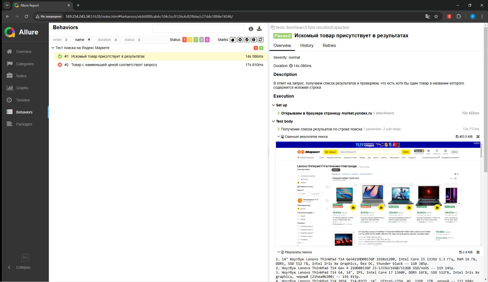

# Автоматизация тестирования. Тестовое задание
Необходимо разработать автотест по сценарию, приложение -
Яндекс.Маркет (https://market.yandex.ru/). Предусмотрены 2 уровня сложности. Выполнение
дополнительного раздела не является обязательным, но увеличивает конечную оценку
работы.

## Ограничения
1. проект автотестов необходимо разработать на языке Java с применением Selenium и TestNG
2. проект необходимо собирать с помощью Maven
3. для поиска элементов на странице использовать xpath, использование других локаторов не
   допускается
4. результат выполнения автотеста - отчет; тест должен быть разбит на шаги в отчете,
   прикреплены скриншоты страниц, добавлены вложения к отчету (список результатов, цены,
   названия магазинов и прочее). В качестве отчета использовать https://docs.qameta.io/allure/
5. код проекта должен быть задокументирован с использованием java doc.
   Желательно проект автотестов разместить на https://github.com/ и скинуть ссылку на почту,
   можно и zip архивом на почту.

## Сценарий
   Необходимо реализовать тест поиска в маркете:
1. открыть страницу Яндекс.Маркет
2. ввести в строку поиска какой-либо товар (например, модель вашего телефона)
3. нажать кнопку Найти
4. получить список найденных товаров (наименование товара - цена)
5. добавить проверку того, что в списке результатов содержится товар, который искали
6. применить сортировку по цене
7. нажать на самый первый результат
8. вывести в консоль название магазина и цену товара
9. закрыть браузер

## Дополнительно
1. добавить управление тестовым набором в xml файле и добавить поддержку в pom.xml файл
   (https://testng.org/)
2. вынести тестовые данные (вводимые значения) в отдельный внешний файл (json, xml, conf и
   прочее на свое усмотрение), в тестах использовать данные, загруженные из файла
3. изучить паттерн page object (https://kreisfahrer.gitbooks.io/selenium-webdriver/content/page_object_pattern_arhitektura_testovogo_proekta/ispolzovanie_patterna_page_object.html), переделать тест с использованием данного паттерна:
   * выделить класс IndexPage или MainPage
   * реализовать метод поиска search, принимающий в качестве аргумента название товара и
   возвращающий в качестве результата список найденных товаров
   * реализовать класс Item, являющийся моделью товара и содержащий поля: название
   товара, цена
   в общем случае должно получиться наподобие
   ```
   WebDriver driver = new ChromeDriver();
   MainPage mainPage = new MainPage(driver);
   List<>Item> results = mainPage.search("запрос");
   ```
   
## Итоги
* Все требования, за исключением п.2 дополнительных, удалось учесть. 
* Шаги сценария были распределены между двумя тестами:  
      1. Получает список первичных результатов в виде списка объектов и проверяет, что в списке есть хотя бы один товар
      в имени которого содержится строка запроса  
      2. Выполняет на странице сортировку результатов по возрастанию цены, затем открывает первый в списке товар, 
      и проверяет есть ли вхождение поисковой строки в имя товара   
* В процессе выполнения тестов, снимаются и прикрепляются к отчету Allure, скриншоты и текстовые данные о результатах
поиска


